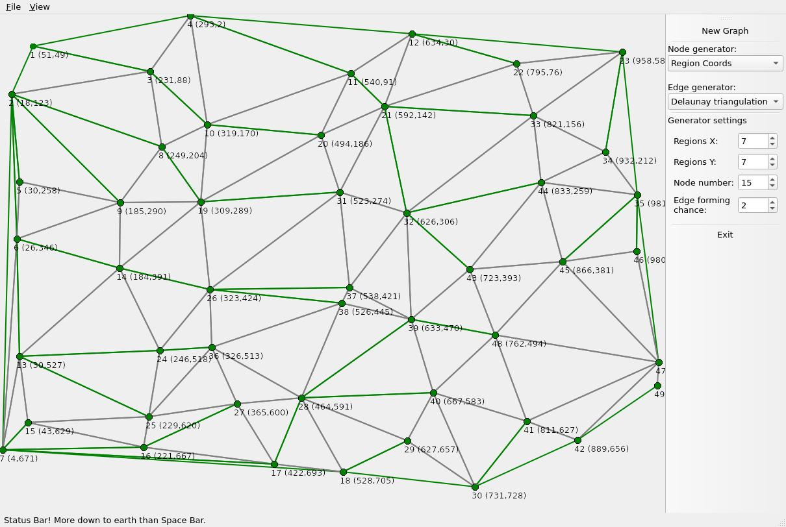
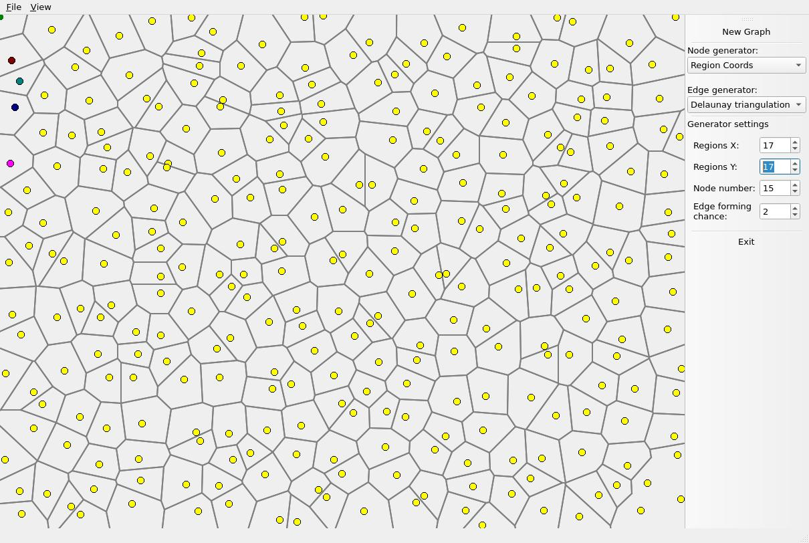

Graph app
==============

A PyQT5 based python app.
You can generate points and then generate a graph on those.
Various graph algorithms like breadth first or create Voronoi tesselation which based on a Delaunay triangulation created with the Bowyer-Watson algorithm.

Delaunay triangulation with spanning tree:

Voronoi diagram:
